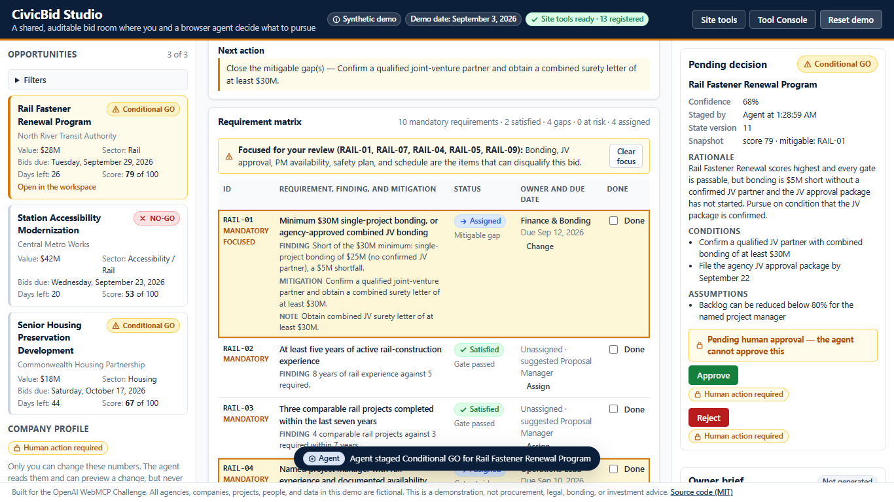

# CivicBid Studio

A shared public-infrastructure bid room where a person and a browser agent evaluate opportunities, uncover disqualification risks, assign compliance work, and stage auditable bid/no-bid decisions — with a human as the only actor who can approve.



- **Live demo:** https://smartjon7.github.io/civicbid-studio/
- **Repository:** https://github.com/smartjon7/civicbid-studio
- **Video:** to be added

Built for the OpenAI WebMCP Challenge. Every agency, company, opportunity, person, and number is fictional.

## Why WebMCP?

A bid/no-bid decision is a shared job. The agent is good at reading a solicitation, spotting the requirement that disqualifies you, and doing the bookkeeping. The person owns the call. Most agent demos let the agent act on a page by guessing at buttons. WebMCP lets the page say, in its own words, what the agent may do here: thirteen site tools that read the bid room, focus requirements, assign owners, register risks, and stage a recommendation.

What the page does not expose matters as much. There is no tool that approves, rejects, or edits the company profile. Those are buttons only a person can click. The agent can ask what would happen if the company confirmed a joint-venture partner (`civicbid_simulate_company_change`), recommend it, then read back exactly what the person changed (`civicbid_get_workspace_state` with `sinceStateVersion`) and revise its recommendation. Every action from either side lands in one version-stamped timeline, so the decision and the trail behind it cannot disagree.

## 30-second judge test

1. Open https://smartjon7.github.io/civicbid-studio/ in the ChatGPT desktop app's built-in browser or in Chrome 149+ with WebMCP enabled (see Browser requirements).
2. Confirm the header badge reads **Site tools ready · 13 registered**. The count is read back from the browser's own tool registry, not hard-coded.
3. Paste the first prompt below. Watch the agent filter, compare, open Rail Fastener Renewal, focus requirements, assign owners, register risks, and stage a Conditional GO. The **Approve** button stays a human-only control.

Full script with expected results: [JUDGE_TEST.md](JUDGE_TEST.md).

## Human-agent workflow

**Prompt 1**

> You are helping a small infrastructure contractor decide what to bid. Use this page's site tools to find opportunities worth more than $20 million that close within 45 days. Compare them, open the strongest opportunity, identify every mandatory requirement and possible disqualification risk, focus those items in the interface, assign the most important gaps to appropriate owners, and stage — but do not approve — a bid/no-bid recommendation. Explain your reasoning and stop for my review.

What happens: the agent finds Rail Fastener Renewal ($28M, 26 days) and Station Accessibility ($42M, 20 days); Senior Housing ($18M) is below the value filter. Station is a NO-GO because the company has zero accessibility-station projects, a gap that cannot be created before bid day. Rail scores 78, Conditional GO: bonding is $5M short of the $30M minimum and the project manager's release is undocumented. The agent focuses those requirements, assigns Finance & Bonding, JV & Legal, the Safety Director, and the Scheduler, registers the risks, and stages a Conditional GO for review.

**Then the person clicks Confirm JV package.** The company profile now shows a confirmed partner with $60M combined bonding. The pending decision card flags that the profile changed since it was staged.

**Prompt 2**

> Read the updated workspace state and tell me exactly what changed. Reevaluate the selected opportunity and revise the staged recommendation if the new company capacity supports it. Do not approve anything.

What happens: the agent calls `civicbid_get_workspace_state` with the version it last saw and receives the one human event, with before-and-after scores. Rail has moved from Conditional GO to GO (85–88 depending on how much work was assigned). The agent re-stages a GO, and the timeline reads "revised from Conditional GO".

**Then the person clicks Approve.**

**Prompt 3**

> Generate a concise executive owner brief from the approved decision, conditions, assignments, risks, deadlines, and the human change that affected the recommendation. Focus on what must happen in the next 24 hours.

What happens: `civicbid_generate_owner_brief` succeeds only now. Before approval it returns `DECISION_NOT_APPROVED`. The brief names the approved decision, the conditions, the owners and dates, the top disqualification risks, the human JV change and the score movement it caused, the next 24 hours, and an audit summary generated from the timeline.

## Site-tool inventory

| Tool | Read/write | Purpose |
|---|---|---|
| `civicbid_list_opportunities` | read | Filter and rank opportunities by value, days to deadline, and sector |
| `civicbid_compare_opportunities` | read (switches the comparison panel) | Score two or three opportunities side by side |
| `civicbid_open_opportunity` | write | Open one opportunity in the workspace |
| `civicbid_get_context` | read | Where things stand: selection, profile, decision status, focus |
| `civicbid_list_requirements` | read | The requirement matrix with status, gate effect, finding, and suggested owner |
| `civicbid_focus_requirements` | write | Highlight requirements in the interface for human review, with a reason |
| `civicbid_assign_requirement` | write | Assign an owner role and due date (idempotent upsert) |
| `civicbid_upsert_risk` | write | Register or update a risk by key (idempotent) |
| `civicbid_stage_decision` | write | Stage a GO / Conditional GO / NO-GO for human approval — never approves |
| `civicbid_get_workspace_state` | read | Full state; `sinceStateVersion` returns the human and system events since that version with before/after scores |
| `civicbid_generate_owner_brief` | write | Executive brief from the approved decision; `DECISION_NOT_APPROVED` until a human approves |
| `civicbid_reset_demo` | write | Restore the synthetic seed; requires `confirm: "RESET_CIVICBID_DEMO"` |
| `civicbid_simulate_company_change` | read | What-if evaluation of a company-profile change without writing anything |

Human-only controls that are deliberately not tools: Approve, Reject, Confirm JV package, company profile edits, marking a requirement done, and the Reset button.

Contracts, bounds, and error codes: [docs/TOOL_CONTRACTS.md](docs/TOOL_CONTRACTS.md).

## Architecture

- **One write path.** Every business write — from a button or a site tool — is a `Command` dispatched through `store.dispatch` into one reducer (`src/store/reducer.ts`). Commands carry provenance (`actor`, `channel`, `tool`). `approve_decision` and `reject_decision` are accepted only from `actor: 'human'` on `channel: 'ui'`; profile edits only from a human. No tool, console command, or URL can reach them.
- **Derived evaluation.** Scores, gates, and recommendations are computed from the company profile, the requirement rules, assignments, completions, and risks by one function (`src/domain/evaluateOpportunity.ts`). Nothing is stored except snapshots inside a staged decision and its approval.
- **Result envelope.** Every tool returns `{ ok, tool, summary, stateVersion, changed, data, warnings, verification, error }`. `verification` carries the activity event id, the selected opportunity, the visible panel, the focused requirement ids, and the decision status, so the agent can confirm what happened. Errors carry `code`, `message`, and `recovery`.
- **Version-stamped timeline.** Every event records actor, channel, tool, action, the fields changed, and the state version before and after. Read-only tool calls are logged without changing the version.
- **Frozen demo date.** Days to deadline are measured from September 3, 2026 so the judge prompt returns the same two opportunities through the judging window.

Details: [docs/ARCHITECTURE.md](docs/ARCHITECTURE.md).

## Local setup

```
npm install
npm run dev       # http://localhost:5173/civicbid-studio/
npm test          # vitest, jsdom
npm run build     # typecheck + production build into dist/
```

The Vite base path is `/civicbid-studio/` for GitHub Pages. For any other host set `VITE_BASE=/` (or your path) before `npm run build`.

## Browser requirements

- **ChatGPT desktop app** (latest) using its built-in browser with **GPT-5.6 Sol** or **GPT-5.6 Terra**. GPT-5.6 Luna currently has site tools disabled.
- **Google Chrome 149+** with `chrome://flags/#enable-webmcp-testing` enabled and the browser relaunched.
- Any other browser shows a fallback banner. The built-in **Tool Console** still runs every tool through the same handlers, so the workflow can be exercised anywhere; it is a testing aid, not WebMCP.

## Privacy and synthetic data

There is no backend, no login, no network call, and no language-model API. All state lives in the browser's `localStorage` under one key. Every agency, company, solicitation, person, role, and figure is fictional. The app is a demonstration, not procurement, legal, bonding, or investment advice.

## Known limitations

See [KNOWN_LIMITATIONS.md](KNOWN_LIMITATIONS.md).

## Challenge-period work

This repository was created on September 3, 2026 during the submission period. All commits are dated; nothing here existed before the challenge.

## License

MIT — see [LICENSE](LICENSE).
